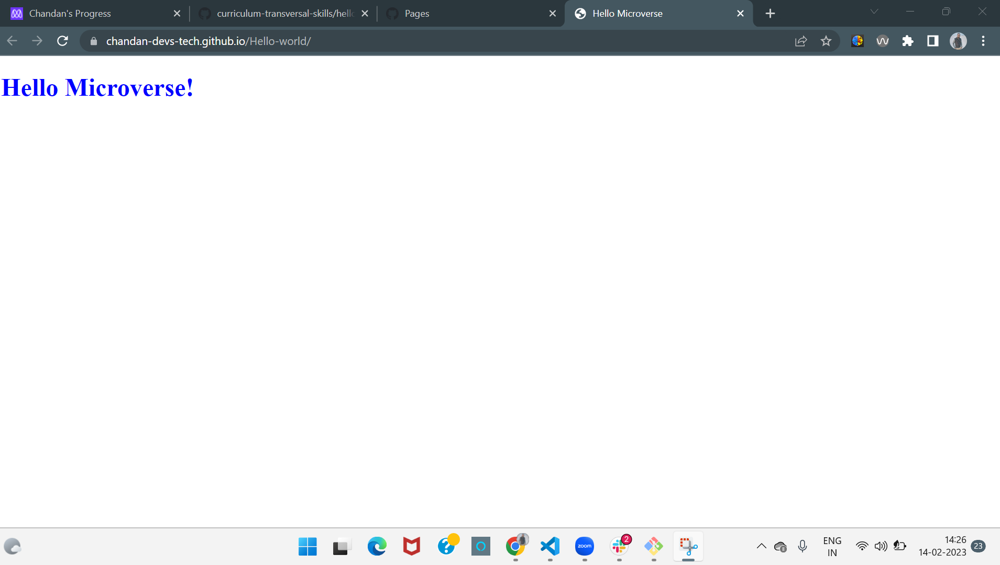

  
   

  <h3><b>HELLO MICROVERSE PROJECT</b></h3>

<!-- TABLE OF CONTENTS -->

# 📗 Table of Contents

- [📖 About the Project](#about-project)
  - [🛠 Built With](#built-with)
  - [🚀 Live Demo](#live-demo)
- [💻 Getting Started](#getting-started)
  - [Setup](#setup)
  - [Prerequisites](#prerequisites)
  - [Run tests](#run-tests)
- [👥 Authors](#authors)
- [🤝 Contributing](#contributing)
- [⭐️ Show your support](#support)
- [🙏 Acknowledgements](#acknowledgements)
- [📝 License](#license)

<!-- PROJECT DESCRIPTION -->

# 📖 [HELLO WORLD] 

> A "Hello World" HTML-5 repository built during the portal learning module.

> It is a show of my understanding of Gitflow, use of Linters and basic HTML5 and CSS3.

## 🛠 Built With 

- HTML5
- CSS3
- Linters

<!-- LIVE DEMO -->

## 🚀 Live Demo 

- [Live Demo Link](https://chandan-devs-tech.github.io/Hello-world/)

(<a href="#readme-top">back to top</a>)

<!-- GETTING STARTED -->

## 💻 Getting Started 

To get a local copy up and running, follow these steps.

### Prerequisites

- Git Installed
- npm Installed
- Code Editor Instaled

### Setup

- Clone this repository to your desired folder https://github.com/Chandan-devs-tech/Hello-world.git
- Run the command npm install to install necessary dependencies contained in the package.json file

### Run tests

- To run tests run :
- npx hint .
- npx stylelint "\*_/_.{css,scss}"
- To test my code locally open index.html file on browser. I printed a blue text printed "Hello Microverse!"

(<a href="#readme-top">back to top</a>)

<!-- AUTHORS -->

## 👥 Authors 

> Mention all of the collaborators of this project.
> 👤 **Author1**

- GitHub: @Chandan-devs-tech
- Twitter: @ChandanGuptaDev
- LinkedIn: www.linkedin.com/in/chandangupta-devs
- Slack: @Chandan Gupta

(<a href="#readme-top">back to top</a>)

<!-- CONTRIBUTING -->

## 🤝 Contributing 

Contributions, issues, and feature requests are welcome!

Feel free to check the [issues page]

(<a href="#readme-top">back to top</a>)

<!-- SUPPORT -->

## ⭐️ Show your support 

Give a ⭐️ if you like this project!

(<a href="#readme-top">back to top</a>)

<!-- ACKNOWLEDGEMENTS -->

## 🙏 Acknowledgments 

- Hat tip to anyone whose code was used
- Inspiration
- etc

(<a href="#readme-top">back to top</a>)

<!-- LICENSE -->

## 📝 License 

This project is [MIT](https://github.com/Chandan-devs-tech/Hello-world/blob/feature/integration/MIT.md) licensed.

(<a href="#readme-top">back to top</a>)

